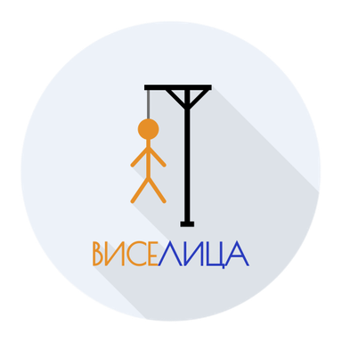
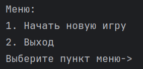
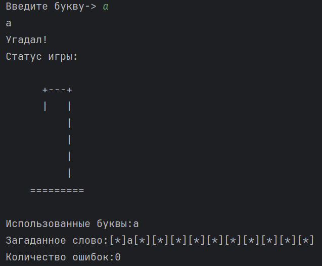
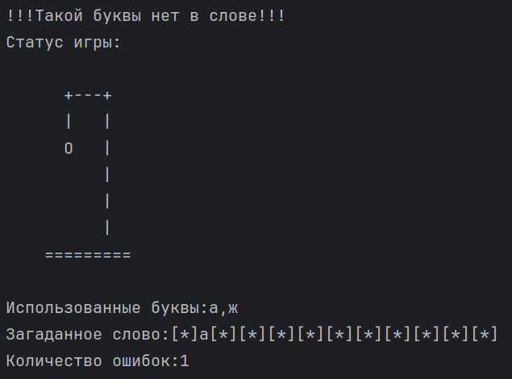

# Игра "Виселица"

"Виселица" - это игра, в которой случайным образом загадывается слово, а игрок пытается его угадать, для этого он
предлагает букву, которая может входить в загаданное слово.
Если такая буква есть в слове, то она отображается — столько раз, сколько встречается в слове. Иначе, за каждый
неправильный ответ добавляется одна часть туловища к виселице. Игрок имеет 6 попыток.
Если туловище в виселице нарисовано полностью, то игрок проиграл. Если игроку удаётся угадать слово, он выигрывает.

Проект создан в рамках **Roadmap Сергея Жукова
** -> [ссылка](https://zhukovsd.github.io/java-backend-learning-course/projects/hangman/)

  

## Структура проекта

* [index.php](index.php) Главный файл, содержащий логику
* [russian_nouns.txt](russian_nouns.txt) Файл, содержащий список слов, необходимых для игры

## Процесс

1. Начните игру выполнив `php index.php` в терминале.
2. На экране появится главное меню игры, введите команду `1` для начала игры.

   

4. После начала игры введите предполагаемую букву.
    - Если буква присутствует в слове, она отобразится — столько раз, сколько она встречается в слове

   

    - Иначе добавится одна часть туловища к виселице и количество попыток уменьшится на 1

   
5. У вас есть 6 попыток, для того чтобы угадать слово.

## Стек

* PHP 8.3
